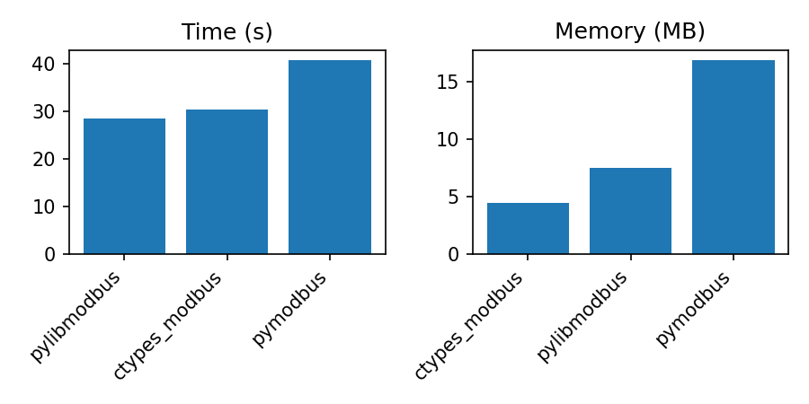

# ctypes-modbus

A lightweight Python Modbus client implemented as a thin wrapper around libmodbus.

This project is similar to `pylibmodbus`, but uses the built-in `ctypes` instead of `cffi`,
eliminating external Python dependencies and reducing memory usage while maintaining comparable performance.


## Dependencies

- python3.8+
- libmodbus5


## Installation

- apt-get install libmodbus5
- pip install ctypes-modbus


## Usage

```python
import logging

from ctypes_modbus import Modbus

logging.basicConfig(level=logging.DEBUG)

mb = Modbus.RTU("/dev/ttyS0", 115200, "N", 8, 1, logger=logging.getLogger())
mb.set_slave(1)
# or
# mb = Modbus.TCP("localhost", 1502)

mb.connect()
mb.write_registers(0, [16, 17])
data = mb.read_registers(0, 2)
logging.info("REGISTERS: %s", [hex(n) for n in data])
```


## Benchmarks

Reading one million registers.

*The memory plots exclude the Python interpreter overhead (~10.3 MB).




**benchmark.csv**

```text
Package;Time;RSS
ctypes_modbus;30.28;4596
pylibmodbus;28.48;7672
pymodbus;40.73;17328
```


## License

MIT
